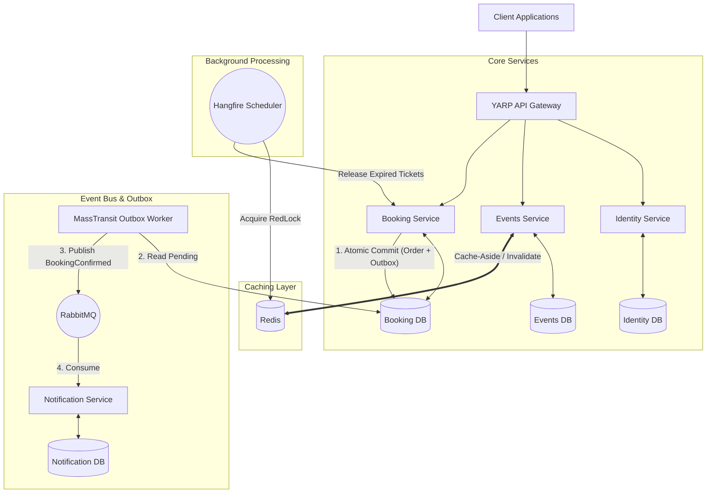

  <h1>🎟️ EventBride</h1>
  <h3>Distributed Event Ticketing & Reservation Platform</h3>
  
Engineered for high-concurrency, data consistency, and fault tolerance in <strong>.NET 10</strong>.

  

    
    
    
    
    
    
  

---

## 🎯 The Engineering Context

Building a CRUD ticketing system is straightforward. Building one that survives a flash sale—where 50,000 users attempt to buy the last 100 tickets at the exact same millisecond—is a distributed systems nightmare. 

**EventBride** is not a basic tutorial project. It is a pragmatic implementation of enterprise-grade distributed systems patterns in the .NET ecosystem. It focuses entirely on the "hard parts" of backend engineering:
- Preventing race conditions and inventory overselling.
- Guaranteeing data consistency across microservices without distributed transactions (2PC).
- Designing resilient service boundaries that don't cascade failures.
- Managing state and background jobs across scaled-out instances.

---

## 🏗️ Architecture & Design Decisions

The solution enforces **Clean Architecture** (Domain ➔ Application ➔ Infrastructure ➔ API) and utilizes **CQRS** to physically separate read-heavy operations from write-heavy transactional flows.

