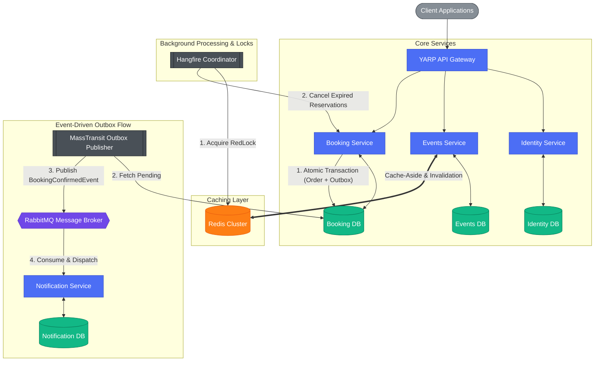

<div align="center">
  <h1>EventBride Platform</h1>
  <p><b>Distributed Event Ticketing & Reservation Microservices Engine</b></p>
  <p>Built with .NET 10 | Enterprise Architecture | High Concurrency & Fault Tolerance</p>

  <p>
    
    
    
    
    
    
    
  </p>
</div>

---

## Technical Context & Problem Statement

Building a basic ticketing CRUD application is simple. Building one that remains reliable during a high-concurrency surge—where thousands of users attempt to purchase a limited number of tickets within the exact same second—requires robust distributed systems engineering.

**EventBride** is a production-hardened microservices solution designed to address critical enterprise backend challenges:
* **Concurrency Control**: Preventing race conditions and double-booking during high-traffic sales.
* **Dual-Write Consistency**: Ensuring database commits and message broker publishing happen atomically via the Transactional Outbox pattern.
* **Fault Tolerance**: Isolating service boundaries using Polly resilience pipelines to prevent cascading failures.
* **Distributed Job Coordination**: Preventing duplicate background processing across scaled service instances using Redis RedLock.

---

## Architecture & System Flow

The platform enforces **Clean Architecture** (Domain ➔ Application ➔ Infrastructure ➔ API) across all services and utilizes **CQRS** to decouple read-intensive queries from write-heavy command processing.



---

## Core Technical Solutions

### 1. High-Concurrency Ticket Reservation
* **Row-Level Pessimistic Locking**: `Events.Infrastructure` employs SQL Server `WITH (UPDLOCK, ROWLOCK)` hints during ticket inventory decrements to guarantee atomic updates and eliminate race conditions under parallel load.
* **Distributed Locks**: Critical cross-service execution paths acquire Redis-backed distributed locks (`IDistributedLockService`) utilizing Lua scripts to ensure single-node execution.

### 2. Transactional Outbox Pattern
* Integrated **MassTransit EF Core Outbox** into `Booking.API`.
* Orders and corresponding integration events (`BookingConfirmedEvent`) are committed within a **single database transaction**, eliminating data drift if the message broker is temporarily unreachable.

### 3. Resilience Pipelines (Polly v8)
* Inter-service HTTP calls rely on `Microsoft.Extensions.Http.Resilience`.
* Configured resilience strategy includes:
  * **Total Timeout**: Enforces upper bounds on outbound HTTP requests.
  * **Exponential Backoff Retry**: Handles transient network glitches.
  * **Circuit Breaker**: Cuts off failing downstream requests to protect system health.

### 4. Background Job Concurrency Control
* **Hangfire Scheduled Cleanup**: Periodically scans for unpaid pending orders exceeding 10 minutes, cancels them, and returns locked tickets to available inventory.
* Guarded by Redis distributed locking to prevent multi-instance job collision in scaled environments.

### 5. Cache-Aside Pattern with Fallback
* High-volume endpoints utilize Redis for distributed caching.
* Implements automatic fallback to `IMemoryCache` if Redis is unreachable, guaranteeing uninterrupted service uptime.

---

## Project Structure

```text
EventBride/
├── src/
│   ├── BuildingBlocks/
│   │   ├── Common.Caching/          # Redis + In-Memory unified wrapper & RedLock implementation
│   │   ├── Common.Logging/          # Serilog bootstrap & structured log enrichers
│   │   └── EventBus.RabbitMQ/       # MassTransit contracts & bus configuration
│   │
│   └── Services/
│       ├── Identity/                # ASP.NET Core Identity & JWT Token Management
│       ├── Events/                  # Catalog, ticket inventory management & CQRS
│       ├── Booking/                 # Reservations, MassTransit Outbox & Hangfire jobs
│       └── Notification/            # Asynchronous worker consuming RabbitMQ events
│
└── tests/
    ├── Booking.UnitTests/           # Unit testing suite for domain logic & Outbox handlers
    ├── Events.UnitTests/            # Concurrency & inventory logic tests
    ├── Booking.IntegrationTests/    # Testcontainers integration testing suite
    └── k6-concurrency-test.js       # k6 load & stress testing script
```

---

## Tech Stack Overview

| Layer | Technology |
|---|---|
| **Framework** | .NET 10.0, ASP.NET Core Web API, C# 13 |
| **Architecture** | Microservices, Clean Architecture, CQRS, DDD |
| **Data Access** | Entity Framework Core 10, SQL Server |
| **Messaging** | MassTransit, RabbitMQ |
| **Caching & Locking** | Redis (StackExchange.Redis), Lua-based RedLock |
| **Background Processing** | Hangfire |
| **Resilience** | Polly v8 (`Microsoft.Extensions.Http.Resilience`) |
| **API Gateway** | YARP (Yet Another Reverse Proxy) |
| **Observability** | Serilog, Seq |
| **Testing** | xUnit, FluentAssertions, Moq, Testcontainers, k6 |

---

## Getting Started

### Prerequisites
* [.NET 10 SDK](https://dotnet.microsoft.com/download/dotnet/10.0)
* [Docker Desktop](https://www.docker.com/products/docker-desktop/)

### Infrastructure Setup

1. **Launch Containers**:
   ```bash
   docker run -d --name eventbride-redis -p 6379:6379 redis:7-alpine
   docker run -d --name eventbride-rabbitmq -p 5672:5672 -p 15672:15672 rabbitmq:3-management
   docker run -d --name eventbride-seq -e ACCEPT_EULA=Y -p 5341:80 datalust/seq:latest
   ```

2. **Run Services**:
   Execute the following in separate terminal windows:
   ```bash
   dotnet run --project src/Services/Identity/Identity.API
   dotnet run --project src/Services/Events/Events.API
   dotnet run --project src/Services/Booking/Booking.API
   dotnet run --project src/Services/Notification/Notification.API
   ```
   *EF Core migrations run automatically on service startup.*

3. **Endpoints & Dashboards**:
   * **Identity API:** `http://localhost:5001/swagger`
   * **Events API:** `http://localhost:5002/swagger`
   * **Booking API:** `http://localhost:5003/swagger`
   * **Hangfire Dashboard:** `http://localhost:5003/hangfire`
   * **Seq Log Server:** `http://localhost:5341`

---

## Verification & Testing

Execute the automated test suite locally:

```bash
# Unit Tests
dotnet test tests/Booking.UnitTests/Booking.UnitTests.csproj
dotnet test tests/Events.UnitTests/Events.UnitTests.csproj

# Stress / Load Testing with k6
k6 run tests/k6-concurrency-test.js
```