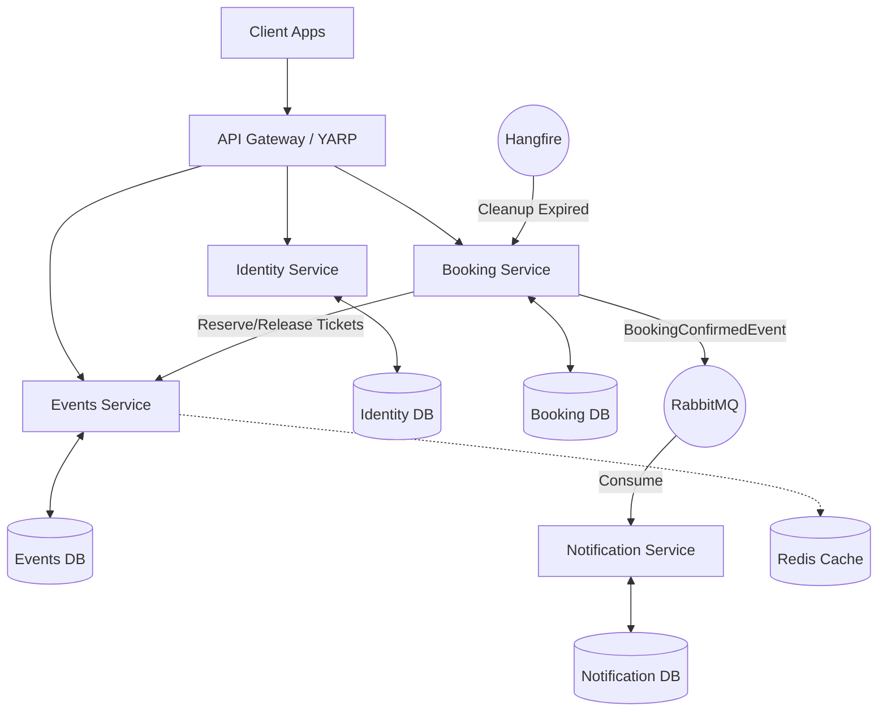

<div align="center">
  <h1>🎟️ EventBride Microservices Platform</h1>
  <p>A production-ready event ticketing and booking platform built with .NET 10, demonstrating advanced microservices architecture, distributed transactions, and concurrency handling.</p>

  [](https://dotnet.microsoft.com/)
  [](https://www.rabbitmq.com/)
  [](https://redis.io/)
  [](https://www.docker.com/)
</div>

<br/>

## 🎯 System Overview

EventBride is a scalable event reservation system that tackles the classic "double-booking" problem. The primary goal of this project is not just to build CRUD APIs, but to demonstrate how to handle **concurrent transactions, distributed caching, and event-driven communication** in a microservices environment.

### 🏗️ High-Level Architecture



---

## 🛠️ Key Technical Implementations

### 1. Concurrency Control (The Core Challenge)
Handling simultaneous bookings for the same seat/ticket is managed using a robust locking strategy:
- **Pessimistic Locking (`UPDLOCK`)**: The ticket inventory is protected using atomic SQL updates ensuring no overselling can occur even under heavy parallel load.
- **Optimistic Concurrency (`RowVersion`)**: Applied on the `Order` entity using EF Core's built-in concurrency tokens.

### 2. Distributed Caching (Cache-Aside Pattern)
- **Redis Integration**: High-traffic endpoints (like `GetFeaturedEvents`) are cached.
- **Fallback Mechanism**: The custom `CacheService` gracefully falls back to `IMemoryCache` if the distributed cache is unavailable.

### 3. Background Jobs & State Management
- **Hangfire**: Periodically runs a `ReservationCleanupJob`. If an order remains in a `Pending` state for more than 10 minutes, the job automatically cancels it and releases the reserved tickets back to the `Events` service.

### 4. Event-Driven Architecture
- **MassTransit & RabbitMQ**: When a payment is successfully processed, the Booking service publishes a `BookingConfirmedEvent`.
- **Decoupled Consumers**: The Notification service consumes this event and logs the outgoing email/SMS, ensuring the booking transaction isn't blocked by slow third-party notification APIs.

### 5. Observability & Logging
- **Serilog + Seq**: Structured logging is configured across all services. Logs are enriched with the service name and context, then forwarded to a centralized Seq instance.

---

## 📂 Project Structure

Each service adheres strictly to **Clean Architecture** principles (Domain ➔ Application ➔ Infrastructure ➔ API), enforcing dependency inversion and highly testable code.

```text
src/
├── BuildingBlocks/                 # Shared libraries
│   ├── Common.Caching/             # Redis + In-Memory unified wrapper
│   ├── Common.Logging/             # Serilog bootstrap & extensions
│   └── EventBus.RabbitMQ/          # MassTransit configuration & Event Contracts
│
├── Services/
│   ├── Identity/                   # ASP.NET Core Identity + JWT Rotation
│   ├── Events/                     # CQRS, Redis caching, Ticket Inventory (UPDLOCK)
│   ├── Booking/                    # Distributed Transactions, Hangfire cleanup
│   └── Notification/               # Worker Service (RabbitMQ Consumer)
```

---

## 🚀 Technologies & Libraries

- **Framework:** .NET 10.0, ASP.NET Core Web API
- **Architecture:** Microservices, Clean Architecture, CQRS
- **Data Access:** Entity Framework Core (SQL Server)
- **Design Patterns:** Repository, Unit of Work, Cache-Aside, Event Sourcing
- **Libraries:**
  - `MediatR` (CQRS implementations)
  - `FluentValidation` (Request pipeline validation)
  - `AutoMapper` (Entity-DTO mapping)
  - `Hangfire` (Background processing)
  - `MassTransit` (RabbitMQ Abstraction)
  - `Serilog` (Structured logging)

---

## 🚦 Getting Started

### Prerequisites
- .NET 10 SDK
- Docker Desktop (for RabbitMQ, Redis, and Seq)
- SQL Server (LocalDB or Docker container)

### Local Setup
1. **Start Infrastructure Services:**
   ```bash
   docker run -d --name eventbride-redis -p 6379:6379 redis:7-alpine
   docker run -d --name eventbride-rabbitmq -p 5672:5672 -p 15672:15672 rabbitmq:3-management
   docker run -d --name eventbride-seq -e ACCEPT_EULA=Y -p 5341:80 datalust/seq:latest
   ```

2. **Run Migrations:**
   Each service will automatically run its EF Core migrations on startup if the database doesn't exist.

3. **Run the Microservices:**
   Open separate terminals and start each service:
   ```bash
   dotnet run --project src/Services/Identity/Identity.API
   dotnet run --project src/Services/Events/Events.API
   dotnet run --project src/Services/Booking/Booking.API
   dotnet run --project src/Services/Notification/Notification.API
   ```

4. **Access Swagger UI:**
   - Identity: `http://localhost:5001/swagger`
   - Events: `http://localhost:5002/swagger`
   - Booking: `http://localhost:5003/swagger`
   - Hangfire Dashboard: `http://localhost:5003/hangfire`

---
*Developed as a showcase of enterprise-grade backend engineering practices in .NET ecosystem.*