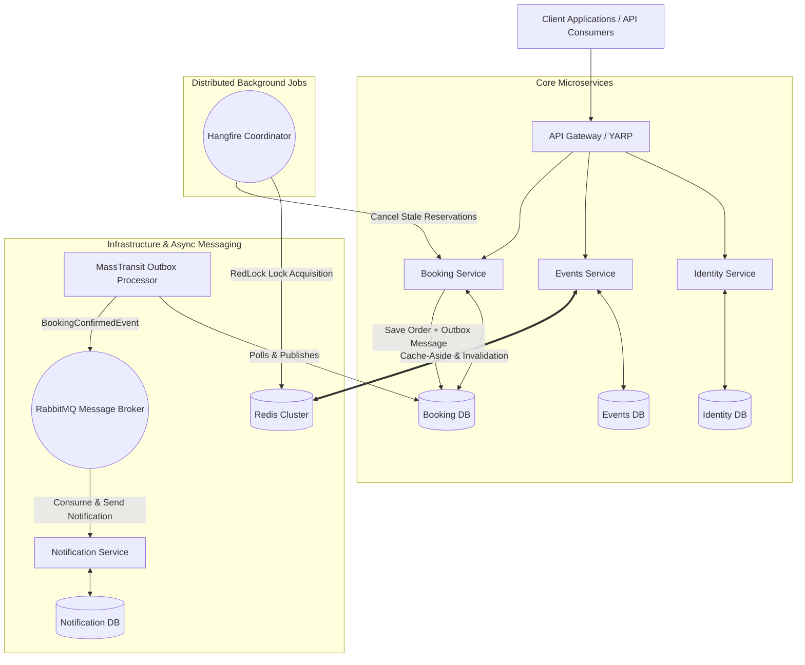

<div align="center">
  <h1>🎟️ EventBride Enterprise Platform</h1>
  <p><b>Production-grade Distributed Event Reservation & Ticketing Microservices built with .NET 10</b></p>

  [](https://dotnet.microsoft.com/)
  [](https://www.rabbitmq.com/)
  [](https://redis.io/)
  [](https://www.docker.com/)
  [](https://www.microsoft.com/sql-server)
  [](https://github.com/App-vNext/Polly)
</div>

<br/>

## 📌 Executive Summary

**EventBride** is a distributed, high-throughput event reservation platform engineered to tackle enterprise-scale backend challenges. The system is designed to solve real-world distributed system problems including **ticket overselling under surge traffic (Race Conditions)**, **dual-write inconsistency (Transactional Outbox)**, **cascading service failures (Polly Resilience Pipelines)**, and **distributed background processing (RedLock + Hangfire)**.

Rather than a simple CRUD sample, this repository showcases production-hardened microservices architecture following strict **Clean Architecture**, **Domain-Driven Design (DDD)**, and **CQRS** principles.

---

## 🏗️ Architecture Diagram



---

## 🚀 Key Production Hardening Features

### 1. High-Concurrency Ticket Reservations (Preventing Over-selling)
- **Pessimistic Row-Level Locking**: Ticket inventory decrements in `Events.Infrastructure` utilize SQL Server `WITH (UPDLOCK, ROWLOCK)` hints. This ensures thread-safe, atomic inventory updates at the database level even during flash-sale traffic surges.
- **Distributed Locking (RedLock)**: Critical cross-service operations acquire Redis-based distributed locks to eliminate race conditions across multiple API instances.

### 2. Distributed Transactions & Transactional Outbox Pattern
- Implemented **MassTransit EF Core Outbox** in `Booking.API`.
- When an order is confirmed, local database updates and integration events (`BookingConfirmedEvent`) are committed in a **single atomic database transaction**.
- Prevents data inconsistency and dual-write issues if the message broker is temporarily unreachable.

### 3. Distributed Resilience Pipeline (Polly v8)
- Inter-service HTTP calls are fortified with `Microsoft.Extensions.Http.Resilience`.
- Features configured pipelines: **Total Request Timeout**, **Rate Limiter**, **Exponential Backoff Retry**, and **Circuit Breaker** to prevent cascading network failures.

### 4. Background Job Concurrency Control
- **Hangfire Clean-up Job**: Scans for unfulfilled reservations older than 10 minutes and gracefully returns tickets back to the available inventory pool.
- Uses `IDistributedLockService` to guarantee that only **one single Hangfire instance** executes cleanup tasks across distributed nodes.

### 5. Multi-Layer Caching Architecture
- **Cache-Aside Pattern**: High-frequency read endpoints (e.g. Featured Events) utilize Redis distributed caching.
- **Graceful Fallback**: If Redis becomes unavailable, the caching layer seamlessly degrades to in-memory caching without throwing runtime exceptions.
- **Event-Driven Invalidation**: Event updates automatically publish invalidation signals to keep cache nodes synchronized.

---

## 📂 Project Structure

The solution enforces strict separation of concerns via Clean Architecture (Domain ➔ Application ➔ Infrastructure ➔ API):

```text
EventBride/
├── src/
│   ├── BuildingBlocks/
│   │   ├── Common.Caching/          # Redis + In-Memory unified wrapper & Distributed Lock
│   │   ├── Common.Logging/          # Serilog bootstrap & structured logging extensions
│   │   └── EventBus.RabbitMQ/       # MassTransit contracts & RabbitMQ bus configuration
│   │
│   └── Services/
│       ├── Identity/                # Authentication, ASP.NET Core Identity & JWT
│       ├── Events/                  # Event Catalog, Inventory Management (UPDLOCK), CQRS
│       ├── Booking/                 # Reservations, MassTransit Outbox, Hangfire & Resilience
│       └── Notification/            # Asynchronous Worker Service (RabbitMQ Consumer)
│
└── tests/
    ├── Booking.UnitTests/           # Unit tests for Handlers & Outbox logic
    ├── Events.UnitTests/            # Ticket inventory concurrency tests
    ├── Booking.IntegrationTests/    # Testcontainers integration suite
    └── k6-concurrency-test.js       # Chaos load testing script for flash-sale scenarios
```

---

## 🛠️ Tech Stack & Ecosystem

| Layer | Technology / Library |
|---|---|
| **Framework** | .NET 10.0, C# 13, ASP.NET Core Web API |
| **Architecture** | Microservices, Clean Architecture, CQRS, Domain-Driven Design |
| **Data Access** | Entity Framework Core 10, SQL Server |
| **Messaging** | MassTransit, RabbitMQ |
| **Caching & Locking** | Redis (StackExchange.Redis), Lua Distributed Lock (RedLock) |
| **Background Processing** | Hangfire |
| **Resilience** | Polly v8 (`Microsoft.Extensions.Http.Resilience`) |
| **API Gateway** | YARP (Yet Another Reverse Proxy) |
| **Observability** | Serilog, Seq Structured Logging |
| **Testing** | xUnit, FluentAssertions, Moq, Testcontainers, k6 |

---

## 🚦 Getting Started

### Prerequisites
- [.NET 10 SDK](https://dotnet.microsoft.com/download/dotnet/10.0)
- [Docker Desktop](https://www.docker.com/products/docker-desktop/)

### Local Development Setup

1. **Spin up Infrastructure Containers:**
   ```bash
   docker run -d --name eventbride-redis -p 6379:6379 redis:7-alpine
   docker run -d --name eventbride-rabbitmq -p 5672:5672 -p 15672:15672 rabbitmq:3-management
   docker run -d --name eventbride-seq -e ACCEPT_EULA=Y -p 5341:80 datalust/seq:latest
   ```

2. **Run Microservices:**
   Launch each service in a separate terminal:
   ```bash
   dotnet run --project src/Services/Identity/Identity.API
   dotnet run --project src/Services/Events/Events.API
   dotnet run --project src/Services/Booking/Booking.API
   dotnet run --project src/Services/Notification/Notification.API
   ```
   *Note: Database migrations execute automatically on startup.*

3. **Access Endpoints & Dashboards:**
   - **Identity API:** `http://localhost:5001/swagger`
   - **Events API:** `http://localhost:5002/swagger`
   - **Booking API:** `http://localhost:5003/swagger`
   - **Hangfire Dashboard:** `http://localhost:5003/hangfire`
   - **Seq Centralized Logs:** `http://localhost:5341`

---

## 🧪 Testing & Quality Assurance

Run the automated test suite locally:

```bash
# Run Unit Tests
dotnet test tests/Booking.UnitTests/Booking.UnitTests.csproj
dotnet test tests/Events.UnitTests/Events.UnitTests.csproj

# Run Load Test with k6
k6 run tests/k6-concurrency-test.js
```