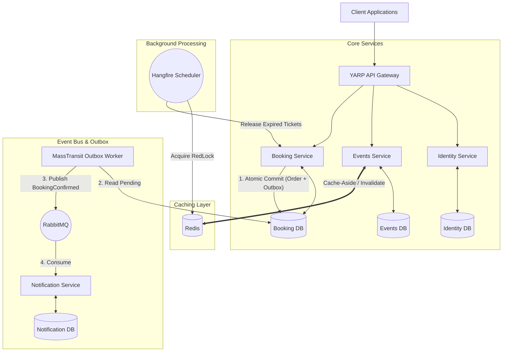

<div align="center">
  <h1>EventBride Microservices Platform</h1>
  <p>Distributed Event Reservation & Ticketing Backend in .NET 10</p>

  [](https://dotnet.microsoft.com/)
  [](https://www.rabbitmq.com/)
  [](https://redis.io/)
  [](https://www.docker.com/)
  [](https://www.microsoft.com/sql-server)
</div>

<br/>

## Overview

EventBride is a distributed event ticketing platform built on .NET 10. The primary focus of this project is solving complex distributed systems problems under high concurrency, rather than basic CRUD operations.

Key problems addressed in this implementation:
- **Preventing ticket over-selling** under concurrent request bursts (Race conditions).
- **Guaranteeing message delivery** between database updates and event publishing (Transactional Outbox).
- **Preventing failure propagation** across HTTP service boundaries (Polly Resilience).
- **Coordinating background jobs** across multiple service instances (Distributed Redis Locking).

---

## Architecture & Communication Flow

The solution follows Clean Architecture (Domain ➔ Application ➔ Infrastructure ➔ API) across all services, with CQRS separating read and write pathways.



---

## Technical Highlights

### Concurrency & Inventory Protection
- **Row-Level Locking**: Ticket inventory decrements in `Events.Infrastructure` use SQL Server `WITH (UPDLOCK, ROWLOCK)` hints to enforce database-level serializable updates without deadlocking.
- **Distributed Locking**: Redis RedLock (`IDistributedLockService`) ensures critical cross-service cleanup logic runs on a single node at any given time.

### Transactional Outbox Pattern
- Order state changes and integration events (`BookingConfirmedEvent`) are committed inside a single database transaction via MassTransit EF Core Outbox.
- Prevents data drift when RabbitMQ is temporarily unreachable during payment confirmation.

### Fault Tolerance & Resilience Pipeline
- Inter-service communication via `HttpClient` is wrapped using `Microsoft.Extensions.Http.Resilience` (Polly v8).
- Configured policies: Total Timeout, Rate Limiter, Exponential Backoff Retry, and Circuit Breaker.

### Cache Strategy & Graceful Degradation
- Read-heavy endpoints use Redis with a Cache-Aside pattern.
- If Redis is unavailable, `CacheService` falls back to `IMemoryCache` without interrupting API responses.

---

## Solution Layout

```text
EventBride/
├── src/
│   ├── BuildingBlocks/
│   │   ├── Common.Caching/          # Redis + In-Memory cache abstraction & RedLock
│   │   ├── Common.Logging/          # Structured Serilog logging bootstrap
│   │   └── EventBus.RabbitMQ/       # MassTransit contracts & RabbitMQ bus setup
│   │
│   └── Services/
│       ├── Identity/                # ASP.NET Core Identity & JWT authentication
│       ├── Events/                  # Catalog, ticket inventory management & CQRS
│       ├── Booking/                 # Reservations, MassTransit Outbox & Hangfire jobs
│       └── Notification/            # Asynchronous RabbitMQ consumer worker
│
└── tests/
    ├── Booking.UnitTests/           # Unit tests for domain logic & Outbox handlers
    ├── Events.UnitTests/            # Ticket inventory concurrency tests
    ├── Booking.IntegrationTests/    # Testcontainers integration tests
    └── k6-concurrency-test.js       # k6 chaos & load test script
```

---

## Tech Stack

- **Framework**: .NET 10.0, ASP.NET Core Web API
- **Architecture**: Microservices, Clean Architecture, CQRS, DDD
- **Persistence**: Entity Framework Core 10, SQL Server
- **Messaging**: MassTransit, RabbitMQ
- **Caching & Locks**: Redis, StackExchange.Redis (RedLock Lua scripts)
- **Background Jobs**: Hangfire
- **Resilience**: Polly v8 (`Microsoft.Extensions.Http.Resilience`)
- **Gateway**: YARP (Yet Another Reverse Proxy)
- **Observability**: Serilog, Seq
- **Testing**: xUnit, FluentAssertions, Moq, Testcontainers, k6

---

## Running Locally

### Prerequisites
- .NET 10 SDK
- Docker Desktop

### Steps

1. **Start Infrastructure Services**:
   ```bash
   docker run -d --name eventbride-redis -p 6379:6379 redis:7-alpine
   docker run -d --name eventbride-rabbitmq -p 5672:5672 -p 15672:15672 rabbitmq:3-management
   docker run -d --name eventbride-seq -e ACCEPT_EULA=Y -p 5341:80 datalust/seq:latest
   ```

2. **Start Services**:
   ```bash
   dotnet run --project src/Services/Identity/Identity.API
   dotnet run --project src/Services/Events/Events.API
   dotnet run --project src/Services/Booking/Booking.API
   dotnet run --project src/Services/Notification/Notification.API
   ```

3. **Endpoints & Dashboards**:
   - Identity API: `http://localhost:5001/swagger`
   - Events API: `http://localhost:5002/swagger`
   - Booking API: `http://localhost:5003/swagger`
   - Hangfire Dashboard: `http://localhost:5003/hangfire`
   - Seq Logs: `http://localhost:5341`

---

## Testing

```bash
# Unit tests
dotnet test tests/Booking.UnitTests/Booking.UnitTests.csproj
dotnet test tests/Events.UnitTests/Events.UnitTests.csproj

# Load testing
k6 run tests/k6-concurrency-test.js
```